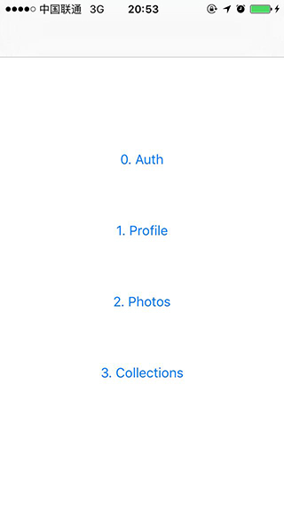
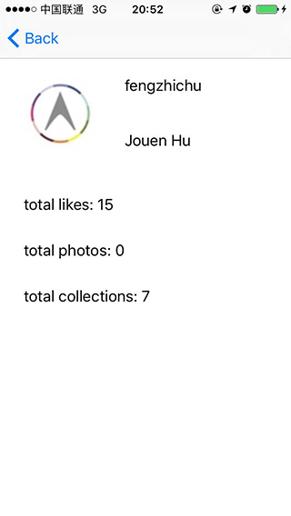
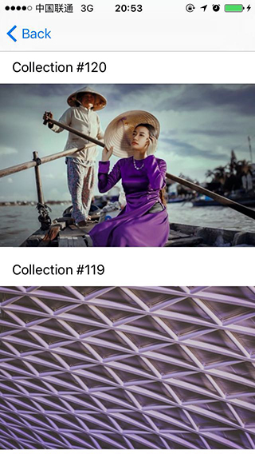

# UnsplashAPI
使用`Objective-C`写的`unsplash.com`的非官方`API`。
1. 在线授权登陆，并把`Access token`存储到`Key chain`中，再次登陆直接从`Key chain`中提取`Access token`;
2. 读取当前登陆用户的个人信息；
3. 加载当前用户上传的图片、点赞的图片已经创建的收藏夹；
4. 分页方式加载`unsplash.com`网站上的精选或者非精选图片；
5. 分页方式加载`unsplash.com`网站上的精选或者非精选`Collection`；
6. 加载后的`json`数据自动装换为`model`;
7. ......

## 预览





## 依赖
使用此库需要以下依赖：
```
pod 'AFNetworking', '~> 3.0'
pod 'YYModel'
```

## 使用
头文件中已经对每个方法的参加做了详细注释，如果依然不明白，可以去[`这里`](https://unsplash.com/documentation)查看`Unsplash API`。
1. 使用此方法获得授权：

```objective-c
[[UnsplashAuthManager sharedAuthManager] authorizeFromController:self completeHandler:^(UnsplashAccessToken *token, NSError *error) {
        NSLog(@"%@", token.accessToken);
    }];
```

2. 读取当前用户个人信息、点赞图片和收藏：

```objective-c
+ (void)getUserProfileWithCompleteHandler:(RequestCompleteHandler _Nullable)handler;

+ (void)updateUserProfileWithUserName:(NSString * _Nullable)userName
                            firstName:(NSString * _Nullable)firstName
                             lastName:(NSString * _Nullable)lastName
                                email:(NSString * _Nullable)email
                          personalUrl:(NSString * _Nullable)url
                             location:(NSString * _Nullable)location
                                  bio:(NSString * _Nullable)bio
                    instagramUserName:(NSString * _Nullable)insName
                      completeHandler:(RequestCompleteHandler _Nullable)handler;

+ (void)getUserPublicProfileWithUserName:(NSString * _Nonnull)userName
                 customProfileImageWidth:(NSUInteger)w
                               andHeight:(NSUInteger)h
                         completehandler:(RequestCompleteHandler _Nullable)handler;

+ (void)listUserUploadedPhotosWithUserName:(NSString * _Nullable)userName
                                      page:(NSUInteger)page
                                   perPage:(NSUInteger)perPage
                                   orderBy:(UnsplashPhotosOrderBy)order
                           completeHandler:(RequestCompleteHandler _Nullable)handler;

+ (void)listUserLikedPhotosWithUserName:(NSString * _Nullable)userName
                                   page:(NSUInteger)page
                                perPage:(NSUInteger)perPage
                                orderBy:(UnsplashPhotosOrderBy)order
                        completeHandler:(RequestCompleteHandler _Nullable)handler;

+ (void)listUserCollectionsWithUserName:(NSString * _Nullable)userName
                                   page:(NSUInteger)page
                                perPage:(NSUInteger)perPage
                        completeHandler:(RequestCompleteHandler _Nullable)handler;

```

3. 获得图片列表、获取单张图片、搜索图片等操作：

```objective-c
+ (void)listPhotosWithPage:(NSUInteger)page
                   perPage:(NSUInteger)perPage
                   orderBy:(UnsplashPhotosOrderBy)order
           completeHandler:(RequestCompleteHandler _Nullable)handler;

+ (void)listCuratedPhotosWithPage:(NSUInteger)page
                          perPage:(NSUInteger)perPage
                          orderBy:(UnsplashPhotosOrderBy)order
                  completeHandler:(RequestCompleteHandler _Nullable)handler;

+ (void)searchPhotosWithQuery:(NSString * _Nonnull)query
                     category:(NSArray * _Nullable)categoryId
                  orientation:(UnsplashPhotoOrientation)orientation
                         page:(NSUInteger)page
                      perPage:(NSUInteger)perPage
              completeHandler:(RequestCompleteHandler _Nullable)handler;

+ (void)getSinglePhotoWithPhotoId:(NSString * _Nonnull)photoId
                            width:(NSUInteger)w
                           height:(NSUInteger)h
                             rect:(CGRect)rect
                  completeHandler:(RequestCompleteHandler _Nullable)handler;

+ (void)getRandomPhotoWithCategory:(NSArray * _Nullable)categoryIds
                       collections:(NSArray * _Nullable)collectionIds
                          featured:(BOOL)featured
                          userName:(NSString * _Nullable)userName
                             query:(NSString * _Nullable)query
                             width:(NSUInteger)w
                            height:(NSUInteger)h
                       orientation:(UnsplashPhotoOrientation)orientation
                   completeHandler:(RequestCompleteHandler _Nullable)handler;

+ (void)getPhotoStatsWithPhotoId:(NSString * _Nonnull)photoId
                 completeHandler:(RequestCompleteHandler _Nullable)handler;

+ (void)updatePhotoInfoWithPhotoId:(NSString * _Nonnull)photoId
                         photoExif:(UnsplashPhotoExif * _Nonnull)exif
                     photoLocation:(UnsplashPhotoLocation * _Nonnull)location
                   completeHandler:(RequestCompleteHandler _Nullable)handler;

+ (void)likePhotoOrNotWithPhotoId:(NSString * _Nonnull)photoId
                           option:(BOOL)option
                  completeHandler:(RequestCompleteHandler _Nullable)handler;

+ (void)likePhotoWithPhotoId:(NSString * _Nonnull)photoId
             completeHandler:(RequestCompleteHandler _Nullable)handler;

+ (void)unlikePhotoWithPhotoId:(NSString * _Nonnull)photoId
               completeHandler:(RequestCompleteHandler _Nullable)handler;

```

4. 对收藏夹的添加图片、移除图片以及创建和删除等操作：

```objective-c
+ (void)listCollectionsWithPage:(NSUInteger)page
                        perPage:(NSUInteger)perPage
                completeHandler:(RequestCompleteHandler _Nullable)handler;

+ (void)listFeaturedCollectionsWithPage:(NSUInteger)page
                                perPage:(NSUInteger)perPage
                        completeHandler:(RequestCompleteHandler _Nullable)handle;

+ (void)listCuratedCollectionsWithPage:(NSUInteger)page
                               perPage:(NSUInteger)perPage
                       completeHandler:(RequestCompleteHandler _Nullable)handler;

+ (void)getCollectionWithCollectionId:(NSUInteger)collectionId
                      completeHandler:(RequestCompleteHandler _Nullable)handle;

+ (void)getCuratedCollectionWithCollectionId:(NSUInteger)collectionId
                             completeHandler:(RequestCompleteHandler _Nullable)handler;

+ (void)getPhotosFromCollectionWithCollectionId:(NSUInteger)collectionId
                                           page:(NSUInteger)page
                                        perPage:(NSUInteger)perPage
                                completeHandler:(RequestCompleteHandler _Nullable)handler;

+ (void)getPhotosFromCuratedCollectionWithCollectionId:(NSUInteger)collectionId
                                                  page:(NSUInteger)page
                                               perPage:(NSUInteger)perPage
                                       completeHandler:(RequestCompleteHandler _Nullable)handler;

+ (void)listRelatedCollectionsWithCollectionId:(NSUInteger)collectionId
                               completeHandler:(RequestCompleteHandler _Nullable)handler;

+ (void)createNewCollectionWithTitle:(NSString * _Nonnull)title
                         description:(NSString * _Nullable)description
                             private:(BOOL)private
                     completeHandler:(RequestCompleteHandler _Nullable)handler;

+ (void)updateCollectionInfoWithCollectionId:(NSUInteger)collectionId
                                       title:(NSString * _Nullable)title
                                 description:(NSString * _Nullable)description
                                     private:(BOOL)private
                             completeHandler:(RequestCompleteHandler _Nullable)handler;

+ (void)deleteCollectionWithCollectionId:(NSUInteger)collectionId
                         completeHandler:(RequestCompleteHandler _Nullable)handler;

+ (void)processPhotoInCollectionWithCollectionId:(NSUInteger)collectionId
                                         photoId:(NSString * _Nonnull)photoId
                                          option:(BOOL)option
                                 completeHandler:(RequestCompleteHandler _Nullable)handler;

+ (void)addPhotoToCollectionWithCollectionId:(NSUInteger)collectionId
                                     photoId:(NSString * _Nonnull)photoId
                             completeHandler:(RequestCompleteHandler _Nullable)handler;

+ (void)removePhotoFromCollectionWithCollectionId:(NSUInteger)collectionId
                                          photoId:(NSString * _Nonnull)photoId
                                  completeHandler:(RequestCompleteHandler _Nullable)handle;


```

5. 查询`unsplash`网站总图片数、浏览数等信息：

```objective-c
+ (void)unsplashStatsWithCompleteHandler:(RequestCompleteHandler _Nullable)handler;
```

## Copyright & License
Copyright (c) 2016 枫之楚

Permission is hereby granted, free of charge, to any person obtaining a copy
of this software and associated documentation files (the "Software"), to deal
in the Software without restriction, including without limitation the rights
to use, copy, modify, merge, publish, distribute, sublicense, and/or sell
copies of the Software, and to permit persons to whom the Software is
furnished to do so, subject to the following conditions:

The above copyright notice and this permission notice shall be included in all
copies or substantial portions of the Software.

THE SOFTWARE IS PROVIDED "AS IS", WITHOUT WARRANTY OF ANY KIND, EXPRESS OR
IMPLIED, INCLUDING BUT NOT LIMITED TO THE WARRANTIES OF MERCHANTABILITY,
FITNESS FOR A PARTICULAR PURPOSE AND NONINFRINGEMENT. IN NO EVENT SHALL THE
AUTHORS OR COPYRIGHT HOLDERS BE LIABLE FOR ANY CLAIM, DAMAGES OR OTHER
LIABILITY, WHETHER IN AN ACTION OF CONTRACT, TORT OR OTHERWISE, ARISING FROM,
OUT OF OR IN CONNECTION WITH THE SOFTWARE OR THE USE OR OTHER DEALINGS IN THE
SOFTWARE.
